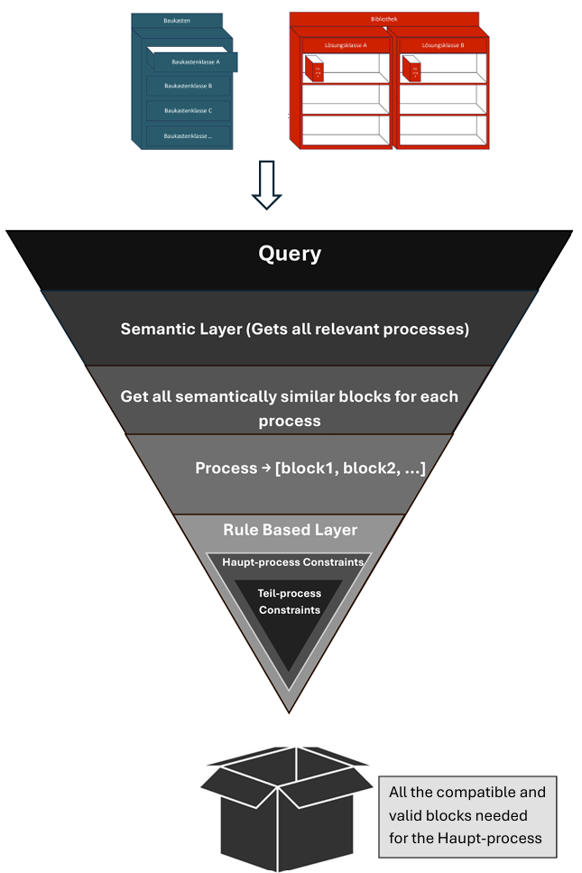

<h1 align="center">
  <a href="">
    DEHN Smart Process Finder 
  </a>
</h1>
<p align="center">
  <strong>Fix Finder 📑</strong>
  <br>
  Assistent for Production Equipment Engineering
</p>

# **DEHN – Next Level Equipment Engineering (Challenge 2)**

## **Introduction**
A smart assistant could streamline the development of suited production equipment from reusable modules. This is a partial automation of the current manual process, making it faster, more accurate, and more accessible.  
The solution aims to help even *inexperienced* users find suitable solutions while also promoting closer collaboration between teams.

---

## **🚀 Features**

### **1. Automatic Database Creation from Excel Sheets**
- Upload the previously used Excel/CSV sheets to automatically create and update the component & process database.
- Handles normalization and linking of:
  - Process Library
  - Building Block (Baukasten) Library
  - Bibliothek–Baukasten Matrix
  - Drop-Down Menus

---

### **2. User-Friendly Query System**
- Natural Language Query UI to allow users to:
  - Describe their requirement in plain language.
  - Receive mapped processes and components automatically.

---

### **3. Highly Efficient Semantic Matching**
- Semantic embeddings for:
  - Processes (from Lösungsbibliothek)
  - Building blocks (from Baukasten)
- Understands contextual similarity between a process description and component descriptions.
- Works even when terminology is slightly different from the stored database.

---

### **4. Interactive UI**
- Clean, user-friendly interface (e.g., Streamlit) with:
  - Step-by-step query processing
  - Matching results with confidence scores
  - Options to review, filter, or override the AI’s recommendation

---

### **5. Optimization Rules**
- Supports logic for:
  - Prioritizing reuse of existing components
  - Ensuring compatibility constraints
  - Ranking solutions for simplicity and completeness


---

## ** Process Flow**



---

## **Tech Stack**
- **Backend / Processing:** Python, SQLite
- **Semantic Search:** Sentence Transformers (e.g., all-MiniLM-L6-v2)
- **Frontend:** Streamlit
- **Data Source:** Excel sheets from DEHN’s existing process & block libraries

---

## **Hackathon Value**
- **Faster Decision-Making:** Quickly maps processes to compatible components.
- **Accessibility:** Assists non-experts in creating robust solutions.
- **Consistency:** Reduces variability in component selection.
- **Scalable:** New processes & components can be integrated without re-engineering the system.

## 📋 Prerequisites

- Python 3.11 or higher
- pip package manager
- Internet connection (for job description extraction)

## 🔧 Installation

### Local Installation

1. **Clone the repository**
   ```bash
   git clone <repository-url>
   cd dehn_hack
   ```

2. **Create virtual environment** (recommended)
   ```bash
   python -m venv venv
   source venv/bin/activate  # On Windows: venv\Scripts\activate
   ```

3. **Install dependencies**
   ```bash
   pip install -r requirements.txt
   ```

### Installation using UV

1. **Install UV from your vendor provider**
   Follow the link : [UV Installation](https://docs.astral.sh/uv/getting-started/installation/)

2. **Install dependencies**
   ```bash
   uv pip install -e .
   ```

## 🚀 How to Run

1. **Start the application**
   ```bash
   streamlit run main.py
   ```

2. **Access the web interface**
   - Open your browser and navigate to `http://localhost:8501`
   - The application will launch automatically

## 📦 Required Dependencies

```
"pandas>=2.3.1",
"psycopg2>=2.9.10",
"python-dotenv>=1.1.1",
"sentence-transformers>=5.1.0",
"streamlit>=1.48.0",
```
---

## 💾 Supported File Formats

### Input Formats
- **Process Data**: Excel/CSV files from DEHN libraries (`.xlsx`, `.csv`)
- **User Queries**: Natural language input
- **Manual Modifications**: Ability to add/update processes and building blocks

### Output Formats
- **Text**: Plain text extraction
- **Markdown**: Structured content with formatting
- **Streamlit Display**: Interactive web interface

---

## 📄 License

This project is licensed under the GNU General Public License v3.0 - see the [LICENSE.txt](LICENSE.txt) file for details.

---

## ➕ Support

For support, bug reports, or feature requests:
- Create an issue on GitHub
- Review the troubleshooting section in the docs

---

### **Note**: This tool is designed to assist in mapping processes to compatible equipment modules and should be used responsibly. Always review generated selections before deploying in production.

---

<p align="center"><strong>Developed with ❤️ for automated equipment engineering from 🇩🇪.</strong></p>


---